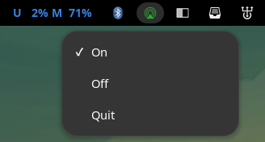
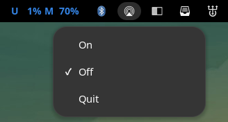

# GUxPlay

A system tray wrapper for [UxPlay](https://github.com/FDH2/UxPlay)

## Requirements

- gtk3
- libappindicator-gtk3

## Install

- Run `make install` to install
- Run `make uninstall` to uninstall

## Screenshots

